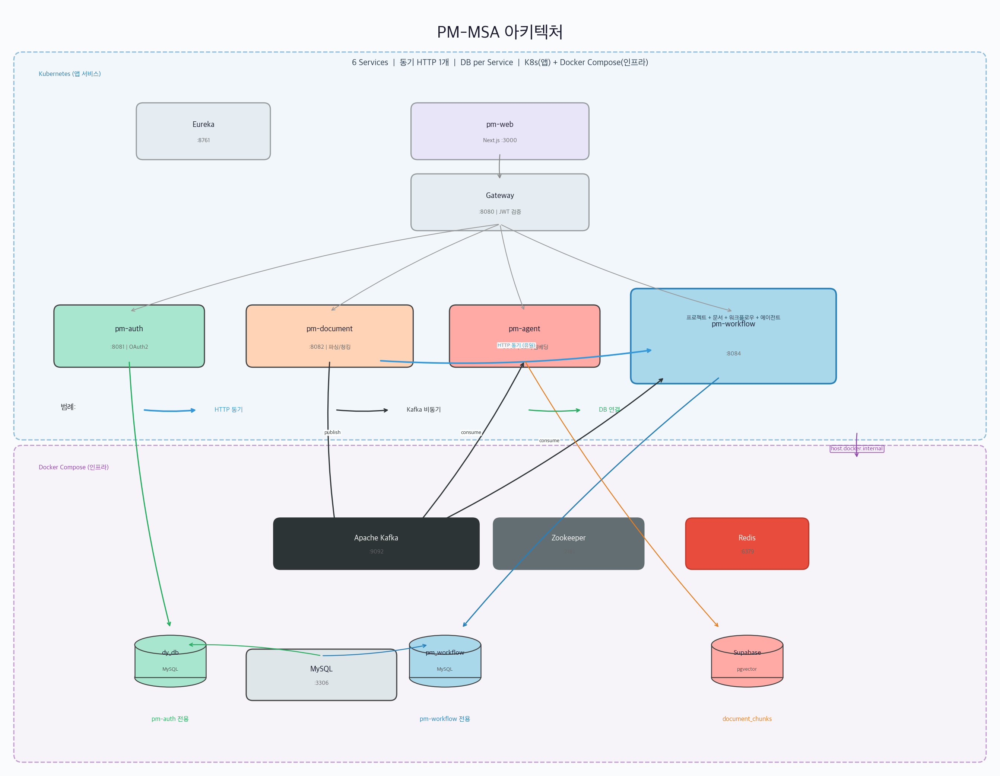

# pm-msa (Personal Manager)

PII 마스킹 기반 프로젝트별 AI 문서 질의 서비스

## 핵심 기능

### 1. Adaptive RAG 채팅
LangGraph 상태머신 기반 AI 채팅 시스템. 질문을 자동 분류(rag/general)하고, 문서 검색 → 관련성 평가 → 응답 생성/쿼리 재작성을 수행합니다. SSE 스트리밍으로 실시간 토큰 단위 응답을 전송합니다.

### 2. 문서 처리 파이프라인
파일 업로드 → 파싱(PDF/DOCX/TXT/Excel/HWP) → 청킹 → 임베딩 → Supabase pgvector 저장까지 전체 자동화. Kafka 이벤트 드리븐으로 서비스 간 비동기 연결합니다.

### 3. Privacy-Preserving AI
문서 저장 시점에 PII(개인정보)를 `[MASK_N]` 토큰으로 마스킹하여 벡터DB에 저장하고, 채팅 응답 시 문서 PII + 질문 PII를 병합하여 원본 복원합니다. Ollama 로컬 LLM 우선, 실패 시 한국어 정규식 fallback으로 동작합니다.

### 4. 프로젝트별 데이터 격리 + 문서 자동 분석
업로드 → 임베딩 → 벡터검색 → 채팅까지 project_id 기반 격리. 임베딩 완료 시 LLM이 추천 질문 5개 + 교차 분석 질문 3개를 자동 생성하여, 채팅 시작 시 추천 질문 버튼으로 표시합니다.

### 5. 문서 마스킹 다운로드
업로드한 문서의 PII를 마스킹하여 다운로드할 수 있습니다. PDF/DOCX는 원본 포맷을 유지하고, Excel은 시트별 CSV 스냅샷으로 변환됩니다 (숨김 시트 자동 제외). 마스킹된 파일과 PII 대조표를 ZIP으로 반환합니다.

### 6. MSA 인프라
Spring Cloud Eureka + Gateway로 6개 서비스 오케스트레이션. Kafka 이벤트 드리븐 아키텍처, JWT 인증 + Gateway 레벨 라우팅을 제공합니다.

## 아키텍처

6개 서비스 | 동기 HTTP 1개 | DB per Service | K8s(앱) + Docker Compose(인프라)



**인프라 구성:**
- **K8s**: 앱 서비스만 배포 (Eureka, Gateway, pm-auth, pm-document, pm-agent, pm-workflow, pm-web)
- **Docker Compose**: Stateful 인프라 (MySQL, Kafka, Zookeeper, Redis)
- K8s Pod → Docker Compose 인프라 접근: `host.docker.internal`

**DB per Service:**
- `dy_db` → pm-auth 전용 (users, user_auth, refresh_tokens)
- `pm_workflow` → pm-workflow 전용 (project, documents, agents, conversations, ...)
- `Supabase pgvector` → pm-agent 전용 (document_chunks)

## 프로젝트 구조

```
pm-msa/
├── README.md
│
├── pm-infra/                     # 인프라 모듈 (Spring Cloud)
│   ├── eureka-server/            # 서비스 디스커버리 서버
│   └── gateway/                  # API Gateway
│
├── pm-auth/                      # 인증 서비스 (Spring Boot)
│   └── src/main/
│
├── pm-document/                  # 문서 처리 서비스 (FastAPI)
│   └── app/
│
├── pm-agent/                     # AI 에이전트 서비스 (FastAPI + LangGraph)
│   └── app/
│
├── pm-workflow/                  # 프로젝트 + 워크플로우 서비스 (Spring Boot)
│   └── src/main/
│
└── pm-web/                       # 프론트엔드 (Next.js)
    └── src/
```

## 모듈 설명

| 모듈 | 기술 | 설명 |
|------|------|------|
| `pm-infra` | Spring Cloud | 인프라 (Eureka, Gateway) |
| `pm-auth` | Spring Boot | 인증/인가 서비스 (JWT, OAuth2) |
| `pm-document` | FastAPI | 문서 업로드, 파싱, 청킹 서비스 |
| `pm-agent` | FastAPI + LangGraph | AI 에이전트 서비스 (RAG, 채팅) |
| `pm-workflow` | Spring Boot | 프로젝트 + 워크플로우 서비스 (프로젝트 관리, 에이전트, 대화, 문서 메타데이터) |
| `pm-web` | Next.js | 프론트엔드 |

## 기술 스택

| 구분 | 버전 |
|------|------|
| Java | 25 |
| Spring Boot | 4.0.2 |
| Spring Cloud | 2025.1.0 (Oakwood) |
| Gradle | 9.3.0 |
| Python | 3.11 |
| FastAPI | 0.115.x |
| LangChain / LangGraph | 0.3.x / 0.2.x |
| Next.js | 16.x |

## 포트 정보

| 서비스 | 포트 | 설명 |
|--------|------|------|
| Eureka Server | 8761 | 서비스 레지스트리 대시보드 |
| Gateway | 8080 | API 진입점 |
| pm-auth | 8081 | 인증 서비스 |
| pm-document | 8082 | 문서 처리 서비스 |
| pm-agent | 8083 | AI 에이전트 서비스 |
| pm-workflow | 8084 | 프로젝트 + 워크플로우 서비스 |
| pm-web | 3000 | 프론트엔드 |
| Kafka | 9092 | 메시지 브로커 |

## 실행 방법

```bash
# 0. 인프라 (Kafka, Redis, Zookeeper, Kafka UI)
docker compose up -d

# 1. Eureka Server 실행 (먼저)
cd pm-infra
./gradlew :eureka-server:bootRun

# 2. Gateway 실행
./gradlew :gateway:bootRun

# 3. Auth 서비스 실행
cd ../pm-auth
DB_PASSWORD=your_password ./gradlew bootRun

# 4. Workflow 서비스 실행
cd ../pm-workflow
DB_PASSWORD=your_password ./gradlew bootRun

# 5. Document 서비스 실행
cd ../pm-document
uvicorn app.main:app --port 8082 --reload

# 6. Agent 서비스 실행
cd ../pm-agent
uvicorn app.main:app --port 8083 --reload

# 7. 프론트엔드 실행
cd ../pm-web
npm run dev

# 8. 확인
# - Eureka 대시보드: http://localhost:8761
# - Gateway: http://localhost:8080
# - Document API 문서: http://localhost:8082/docs
# - Agent API 문서: http://localhost:8083/docs
# - Workflow Swagger: http://localhost:8084/swagger-ui.html
# - 프론트엔드: http://localhost:3000
```

## Kubernetes (로컬)

Docker Desktop Kubernetes를 사용한 로컬 클러스터 배포입니다.
인프라(MySQL, Kafka, Redis)는 Docker Compose로, 앱 서비스만 K8s에 배포합니다.

### 통신 구조

IntelliJ 로컬 개발과 K8s 배포 모두 **동일한 포트**로 접근합니다.

```
┌─ IntelliJ 로컬 개발 ──────────────────────────────┐
│  브라우저 → localhost:3000 (npm run dev)            │
│          → localhost:8080 (Gateway bootRun)        │
│  인프라   → Docker Compose (MySQL, Kafka, Redis)   │
└────────────────────────────────────────────────────┘

┌─ K8s 배포 ─────────────────────────────────────────┐
│  브라우저 → localhost:3000 (LoadBalancer → pm-web)   │
│          → localhost:8080 (LoadBalancer → gateway)  │
│  인프라   → Docker Compose (MySQL, Kafka, Redis)    │
│  K8s Pod → host.docker.internal으로 인프라 접근      │
└─────────────────────────────────────────────────────┘
```

- Gateway, pm-web: `LoadBalancer` 타입 (Docker Desktop이 localhost에 직접 매핑)
- 나머지 서비스: `ClusterIP` (K8s 내부 통신, Eureka 서비스 디스커버리)
- `NEXT_PUBLIC_API_BASE_URL=http://localhost:8080` — 양쪽 동일

### 사전 준비
- Docker Desktop에서 Kubernetes 활성화
- `k8s/secret.yaml` 생성 (`.gitignore` 대상)
- Docker Compose 인프라 실행: `docker compose up -d`

### 이미지 빌드 & 배포

```bash
# 1. 전체 이미지 빌드
./k8s/build.sh

# 2. 특정 서비스만 빌드
./k8s/build.sh pm-auth

# 3. K8s 배포
kubectl apply -k k8s/

# 4. 상태 확인
kubectl get pods -n pm-msa

# 5. 전체 삭제
kubectl delete all --all -n pm-msa
```

### 접속 정보

| 서비스 | URL | 비고 |
|--------|-----|------|
| 프론트엔드 | http://localhost:3000 | IntelliJ / K8s 동일 |
| API (Gateway) | http://localhost:8080 | IntelliJ / K8s 동일 |
| Kafka UI | http://localhost:8090 | Docker Compose |

### 코드 수정 후 재배포

```bash
./k8s/build.sh pm-auth                    # 변경된 서비스만 빌드
kubectl rollout restart deployment/pm-auth -n pm-msa  # Pod 재시작
```

## 빌드

```bash
# 인프라 빌드
cd pm-infra
./gradlew build

# Auth 서비스 빌드
cd pm-auth
./gradlew build

# Workflow 서비스 빌드
cd pm-workflow
./gradlew build

# Document 서비스 (Docker)
cd pm-document
docker build -t pm-document .

# Agent 서비스 (Docker)
cd pm-agent
docker build -t pm-agent .

# 프론트엔드 빌드
cd pm-web
npm run build
```

## Hybrid AI Setup (Optional)

로컬 Ollama를 활용한 Privacy-Preserving 모드를 사용하려면:

```bash
# 1. Ollama + pgvector 기동
docker compose --profile local-ai up -d

# 2. Ollama 모델 다운로드
docker exec pm-ollama ollama pull llama3.2:3b
docker exec pm-ollama ollama pull bge-m3

# 3. pm-agent .env 설정
OLLAMA_ENABLED=true
PII_MASKING_ENABLED=true
PRIVACY_MODE=security          # 또는 performance
USE_LOCAL_VECTORSTORE=true     # 로컬 pgvector 사용 시
```

### Privacy Mode

| Mode | 설명 |
|------|------|
| `performance` | OpenAI 우선 (빠른 응답, 클라우드 의존) |
| `security` | Ollama 우선 (PII 보호, 로컬 처리) |

### Ollama 모델 관리

PII 감지와 경량 LLM에 사용되는 Ollama 모델을 교체할 수 있습니다.

```bash
# 설치된 모델 확인
ollama list

# 모델 다운로드
ollama pull llama3.2:3b      # PII 감지용 (기본)
ollama pull llama3.2:1b      # 경량 대안
ollama pull bge-m3           # 임베딩용

# 모델 삭제
ollama rm <모델명>
```

모델 교체는 `pm-agent/.env` (또는 `app/config.py`)에서 설정합니다:

| 환경변수 | 기본값 | 용도 |
|----------|--------|------|
| `OLLAMA_MODEL_PII` | `llama3.2:3b` | PII 감지 모델 |
| `OLLAMA_MODEL_LIGHT` | `llama3.2:3b` | 경량 LLM (라우팅, 평가 등) |
| `OLLAMA_EMBEDDING_MODEL` | `bge-m3` | 로컬 임베딩 모델 |

```bash
# 예: PII 감지를 1b 경량 모델로 교체
OLLAMA_MODEL_PII=llama3.2:1b

# 예: 더 큰 모델로 교체 (정확도 향상, 속도 저하)
OLLAMA_MODEL_PII=llama3.1:8b
ollama pull llama3.1:8b
```

> **참고**: 모델이 클수록 PII 감지 정확도가 높지만 응답 속도가 느려집니다. `llama3.2:3b`은 정확도와 속도의 균형점입니다.

### PII 마스킹 파이프라인

문서 업로드 시 PII가 자동으로 마스킹되어 벡터DB에 저장됩니다.

```
[파일 업로드] → 파싱 → 청킹 → PII 마스킹 (Ollama/regex)
  → 마스킹된 텍스트로 임베딩 → Supabase 저장 (마스킹 content + pii_mapping)

[채팅 질의] → 질문 마스킹 → 벡터 검색 (마스킹된 컨텍스트)
  → OpenAI 질의 → 응답 언마스킹 (질문 PII + 문서 PII 복원) → 사용자
```

| 설정 | 기본값 | 설명 |
|------|--------|------|
| `PII_MASKING_ENABLED` | `true` | PII 마스킹 활성화 |
| `PII_REGEX_FALLBACK` | `true` | Ollama 실패 시 한국어 정규식 fallback |
| `OLLAMA_ENABLED` | `true` | Ollama LLM 기반 PII 감지 활성화 |

Ollama 비활성화 시 정규식만으로 PII를 감지합니다 (전화번호, 이메일, 주민번호, 카드번호, 계좌번호).

### 프로젝트별 채팅 + 문서 자동 분석 (Phase 6)

문서 업로드 시 프로젝트별 격리된 RAG 검색과 자동 분석 질문 생성을 지원합니다.

```
[문서 업로드] → pm-document → Kafka(document.chunked + projectId)
  → pm-agent → PII 마스킹 → 임베딩 → Supabase 저장 (+project_id)
  → 자동 분석: 마스킹된 내용 → OpenAI 질문 생성 + 교차 분석
  → Kafka(document.analysis.completed) → pm-workflow 추천 질문 저장

[채팅] → pm-agent(question, project_id)
  → mask → retrieve(project_id 필터) → generate → unmask → 사용자
```

| 설정 | 기본값 | 설명 |
|------|--------|------|
| `AUTO_ANALYSIS_ENABLED` | `true` | 임베딩 완료 후 자동 질문 생성 |

프론트엔드에서는 프로젝트 선택 시 문서 목록(정렬 토글)을 표시하고, 채팅 패널이 해당 프로젝트 문서만 대상으로 RAG 검색합니다.
