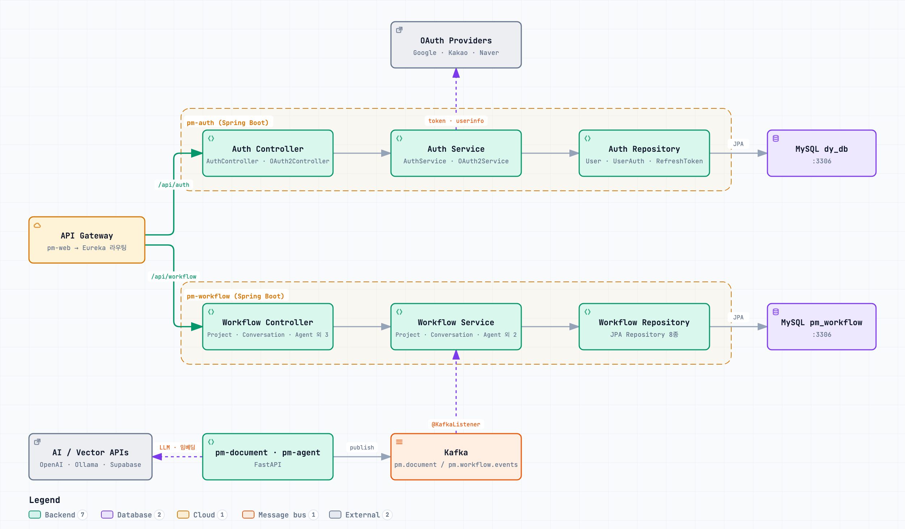

# PM-MSA 계층 아키텍처 다이어그램

> 작성일: 2026-09-24 · 도구: [archify](https://github.com/tt-a1i/archify) (architecture 타입, showcase 품질 검증 통과)

Java 서비스(pm-auth, pm-workflow)의 **Controller → Service → Repository → MySQL** 계층 흐름과 외부 API 호출, Kafka 비동기 흐름을 정리한 다이어그램.



## 파일

| 파일 | 설명 |
|---|---|
| [`diagrams/pm-msa.architecture.json`](diagrams/pm-msa.architecture.json) | 다이어그램 원본 스펙 (수정 시 이 파일 편집) |
| [`diagrams/pm-msa-architecture.html`](diagrams/pm-msa-architecture.html) | 인터랙티브 뷰어 (테마 전환, 확대/축소, 검색, PNG/SVG 내보내기) |
| [`diagrams/pm-msa-architecture.visual-check.1440x900.light.png`](diagrams/pm-msa-architecture.visual-check.1440x900.light.png) | 스크린샷 1440×900 라이트 |
| [`diagrams/pm-msa-architecture.visual-check.1440x900.dark.png`](diagrams/pm-msa-architecture.visual-check.1440x900.dark.png) | 스크린샷 1440×900 다크 |
| [`diagrams/pm-msa-architecture.visual-check.2048x1320.light.png`](diagrams/pm-msa-architecture.visual-check.2048x1320.light.png) | 스크린샷 2048×1320 라이트 |
| [`diagrams/pm-msa-architecture.visual-check.2048x1320.dark.png`](diagrams/pm-msa-architecture.visual-check.2048x1320.dark.png) | 스크린샷 2048×1320 다크 |

## 구성 요소

### pm-auth (DB: `dy_db`)

| 계층 | 클래스 |
|---|---|
| Controller | `AuthController`, `OAuth2Controller` |
| Service | `AuthService`, `OAuth2Service` |
| Repository | `UserRepository`, `UserAuthRepository`, `RefreshTokenRepository` |
| 외부 호출 | `GoogleOAuth2Client`, `KakaoOAuth2Client`, `NaverOAuth2Client` (WebClient) |

외부 OAuth 엔드포인트:
- Google: `accounts.google.com/o/oauth2/v2/auth`, `www.googleapis.com/oauth2/v3/userinfo`
- Kakao: `kauth.kakao.com/oauth/authorize`, `kauth.kakao.com/oauth/token`, `kapi.kakao.com/v2/user/me`
- Naver: `nid.naver.com/oauth2.0/authorize`, `nid.naver.com/oauth2.0/token`, `openapi.naver.com/v1/nid/me`

### pm-workflow (DB: `pm_workflow`)

| 계층 | 클래스 |
|---|---|
| Controller | `ProjectController`, `ConversationController`, `AgentController`, `DocumentController`, `WorkflowController`, `SuggestedQuestionController` |
| Service | `ProjectService`, `ConversationService`, `AgentService`, `DocumentService`, `SuggestedQuestionService` |
| Repository | `ProjectRepository`, `ConversationRepository`, `MessageRepository`, `AgentRepository`, `AgentDocumentRepository`, `DocumentRepository`, `WorkflowExecutionRepository`, `SuggestedQuestionRepository` |
| Kafka Consumer | `WorkflowEventConsumer` — `pm.document.events`, `pm.workflow.events` 구독 (group: `pm-workflow-group`) |

### Python 서비스 (pm-document, pm-agent)

- Kafka로 이벤트 발행 → pm-workflow가 소비 (예: 추천 질문 저장 `SuggestedQuestionService.saveAll`)
- 외부 호출: OpenAI(LLM·임베딩), Ollama(PII 마스킹·로컬 모델), Supabase(pgvector)

## 흐름 요약

1. **동기 요청**: pm-web → API Gateway → `/api/auth` 또는 `/api/workflow` → Controller → Service → Repository(JPA) → MySQL
2. **외부 인증**: `OAuth2Service` → OAuth2Client → Google/Kakao/Naver (토큰 발급·사용자 정보 조회)
3. **비동기 이벤트**: pm-document/pm-agent → Kafka → `WorkflowEventConsumer` → Service
4. **DB 원칙**: `dy_db`(인증) / `pm_workflow`(업무) 분리, FK 미사용, 크로스 DB는 논리적 ID 참조

## 참고 / 추후 정리할 점

- Java 서비스 간 직접 HTTP 호출(Feign 등)은 없음 (WebClient는 외부 OAuth 호출에만 사용). 서비스 간 통신은 Gateway 라우팅과 Kafka뿐.
- Gateway → Python 서비스(pm-agent, pm-document) 라우팅, Redis, Eureka는 이 다이어그램 범위에서 제외.
- 뷰어 UI(버튼 등)는 영어로 표시됨 (archify가 한국어 UI를 지원하지 않음).

## 재생성 방법

```bash
cd ~/.claude/skills/archify
node bin/archify.mjs validate architecture <repo>/docs/diagrams/pm-msa.architecture.json --quality showcase --json
node bin/archify.mjs deliver architecture <repo>/docs/diagrams/pm-msa.architecture.json <repo>/docs/diagrams/pm-msa-architecture.html --quality showcase --json
node bin/archify.mjs visual-check <repo>/docs/diagrams/pm-msa-architecture.html --json
```
